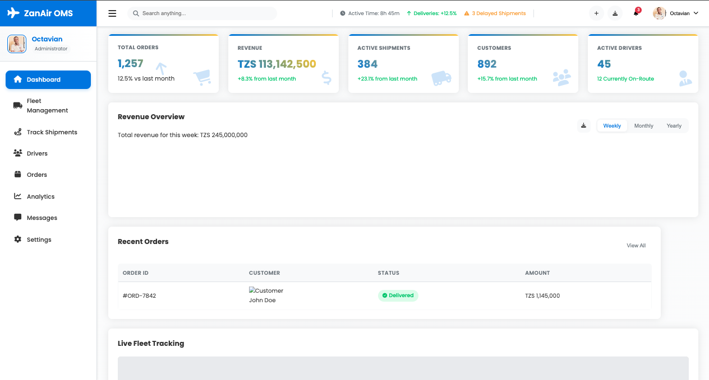

<div align="center">
  <h1>🚚 Fleet & Order Management System</h1>
  
  []()
  [](https://github.com/Ocdeed/oms-project/issues)
  <!-- [](/LICENSE) -->

  <p>A modern, responsive dashboard for managing fleet operations and order logistics</p>
</div>

---

## 📋 Table of Contents

- [About](#-about)
- [Features](#-features)
- [Tech Stack](#-tech-stack)
- [Getting Started](#-getting-started)
- [Screenshots](#-screenshots)
- [API Documentation](#-api-documentation)
- [Contributing](#-contributing)
<!-- - [License](#-license) -->

## 🎯 About

The Fleet & Order Management System is a comprehensive solution designed to streamline logistics operations. It provides real-time tracking, analytics, and management tools for fleet operators and logistics managers.

## ✨ Features

- **Real-time Fleet Tracking** 🛰️

  - Live vehicle location monitoring
  - Route optimization
  - Geofencing alerts

- **Order Management** 📦

  - Order status tracking
  - Delivery scheduling
  - Customer notifications

- **Analytics Dashboard** 📊

  - Performance metrics
  - Resource utilization
  - Cost analysis

- **Weather Integration** ⛈️
  - Real-time weather alerts
  - Route weather forecasting
  - Safety advisories

## 🛠 Tech Stack

- Frontend:

  - HTML5/CSS3
  - JavaScript (ES6+)
  - [Chart.js](https://www.chartjs.org/) for analytics
  - [Leaflet.js](https://leafletjs.com/) for maps

- Backend:
  - Node.js
  - Express.js
  - MongoDB
  - WebSocket for real-time updates

## 🚀 Getting Started

```bash
# Clone the repository
git clone https://github.com/your-username/oms-project.git

# Navigate to project directory
cd oms-project

# Install dependencies
npm install

# Start development server
npm run dev
```

## 📸 Screenshots

<div align="center">
  
  <p><em>Main Dashboard View</em></p>
</div>

## 📖 API Documentation

### Base URL

```
https://api.oms-project.com/v1
```

### Authentication

```javascript
GET /auth/token
Header: Authorization: Bearer <your_api_key>
```

### Endpoints

| Method | Endpoint | Description         |
| ------ | -------- | ------------------- |
| GET    | /fleet   | Retrieve fleet data |
| POST   | /orders  | Create new order    |
| PUT    | /track   | Update tracking     |

## 🤝 Contributing

1. Fork the Project
2. Create your Feature Branch (`git checkout -b feature/AmazingFeature`)
3. Commit your Changes (`git commit -m 'Add some AmazingFeature'`)
4. Push to the Branch (`git push origin feature/AmazingFeature`)
5. Open a Pull Request

<!-- ## 📄 License

Distributed under the MIT License. See `LICENSE` for more information. -->

---

<div align="center">
  <h3>💼 Contact</h3>
  <p>
    Your Name - <a href="mailto:rwehumbizaoctavian23@gmail.com">your.email@example.com</a><br>
    Project Link: <a href="https://github.com/your-username/oms-project">https://github.com/your-username/oms-project</a>
  </p>
  
  [](https://linkedin.com/in/your-profile)
  [](https://twitter.com/your-handle)
</div>
